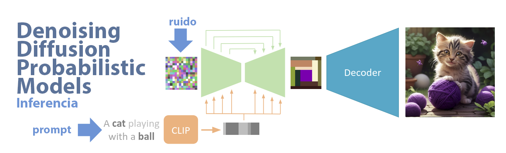
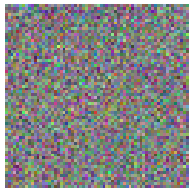
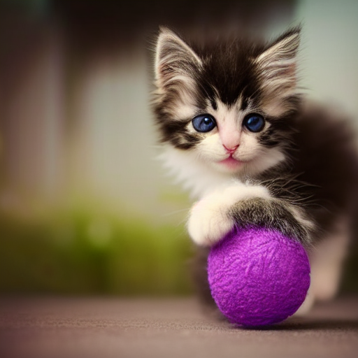

# ¿Cómo los modelos de difusión crean imágenes a partir de ruido?


En mi última conferencia surgió una pregunta clave: ¿cómo es posible que los modelos de difusión generen una imagen a partir de ruido puro? Esta duda no solo es válida, sino que apunta directamente al corazón de estos modelos. Para responderla, es necesario entender no solo el proceso de difusión, sino también el papel fundamental de la representación latente.

En la explicación original utilicé como referencia *Stable Diffusion*, aunque existen múltiples variantes del enfoque. Sin embargo, todas comparten una idea central: el modelo no trabaja directamente sobre imágenes en píxeles, sino sobre una representación comprimida de ellas. Aquí entra en juego el **VAE (Variational Autoencoder)**.

El VAE cumple una función crucial: transformar una imagen en una **imagen latente**, es decir, una versión comprimida que conserva las características más representativas de la imagen original. No se trata de una compresión cualquiera, como reducir el tamaño de un archivo, sino de una compresión semántica. En este espacio latente, lo importante no es cada píxel individual, sino las estructuras, patrones y relaciones que definen el contenido de la imagen. En otras palabras, el VAE traduce una imagen compleja en una forma más manejable, donde lo esencial permanece y lo redundante se descarta.

Este detalle no es menor. Trabajar en el espacio latente hace que el proceso sea mucho más eficiente computacionalmente y, además, más estable desde el punto de vista del aprendizaje. Así, el modelo de difusión no aprende a limpiar ruido en imágenes de alta resolución directamente, sino en esta representación más compacta y estructurada.

Durante el entrenamiento, el proceso consiste en tomar esa imagen latente y añadirle ruido de manera progresiva, en múltiples etapas. En cada uno de estos pasos, un modelo tipo U-Net aprende a predecir exactamente qué ruido fue añadido. Este aprendizaje no es trivial: el modelo debe reconocer patrones en medio de la degradación y estimar cuánto del contenido original aún persiste.

El proceso está guiado por un componente adicional llamado *scheduler*, que define tanto la cantidad de ruido que se introduce en cada etapa como la forma en que este debe ser removido posteriormente. Lo que el modelo realmente aprende, entonces, no es a generar imágenes directamente, sino a identificar y eliminar ruido de manera progresiva, paso a paso.

```python
scheduler = LMSDiscreteScheduler(
    beta_start=0.00085,
    beta_end=0.012,
    beta_schedule="scaled_linear",
    num_train_timesteps=1000
)
scheduler.set_timesteps(50)
```

Una vez entrenado, el proceso se invierte. En lugar de partir de una imagen real, se comienza desde una imagen latente compuesta únicamente por ruido aleatorio. A partir de ahí, el modelo aplica iterativamente lo que aprendió: en cada paso elimina una pequeña porción del ruido, guiado tanto por el scheduler como por el *prompt* que condiciona la generación.

```python
# Initiating random noise
latents = torch.randn((bs, unet.in_channels, w//8, h//8))
```

Este tensor representa el punto de partida: una imagen latente completamente desordenada. Y, sin embargo, es precisamente desde este caos donde emerge la imagen final.



Para hacerlo más tangible, podemos visualizar parte de este ruido. Aunque el modelo trabaja con cuatro canales en el espacio latente, observar tres de ellos es suficiente para entender la naturaleza del dato: no hay estructura visible, solo variación aleatoria.

```python
# seleccionar los primeros 3 canales
latents_3 = latents[0, :3, :, :]  # (3, 64, 64)

# normalizar a [0,1]
latents_3 = (latents_3 - latents_3.min()) / (latents_3.max() - latents_3.min())

# cambiar a (H, W, C)
img = latents_3.permute(1, 2, 0).cpu().numpy()

plt.imshow(img)
plt.axis("off")
plt.show()
```

Lo que se observa es, efectivamente, una imagen sin forma, sin semántica, sin intención: ruido puro. Sin embargo, ese mismo ruido contiene el potencial de convertirse en una imagen coherente.



La clave está en el proceso iterativo. En cada paso, el modelo reduce el ruido basándose en patrones aprendidos durante el entrenamiento. El *prompt* actúa como una guía que orienta esa reconstrucción hacia una dirección específica dentro del espacio latente. Finalmente, una vez que el ruido ha sido suficientemente eliminado, la imagen latente resultante es decodificada nuevamente por el VAE, transformándose en una imagen visible en el espacio de píxeles.

El contraste es notable. Se comienza con ruido completamente aleatorio, se aplica una secuencia de refinamientos controlados, y se termina con una imagen estructurada y coherente. Desde fuera, parece magia; desde dentro, es un proceso cuidadosamente aprendido.

En esencia, el modelo no crea desde la nada. Lo que hace es más interesante: parte del ruido (torch.randn), lo organiza progresivamente —guiado por el U-Net y el scheduler— y, solo al final, lo decodifica mediante el VAE, revelando una estructura que antes no era evidente.

Ver el código completo [aquí](https://drive.google.com/file/d/10eit9QAsJNxnwJEtVOV8dlKKENzbGBpZ/view?usp=sharing).

